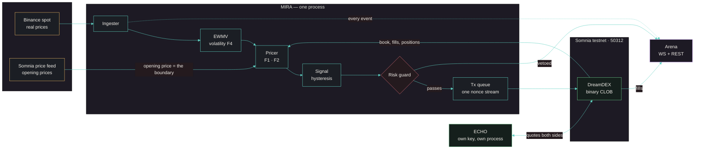
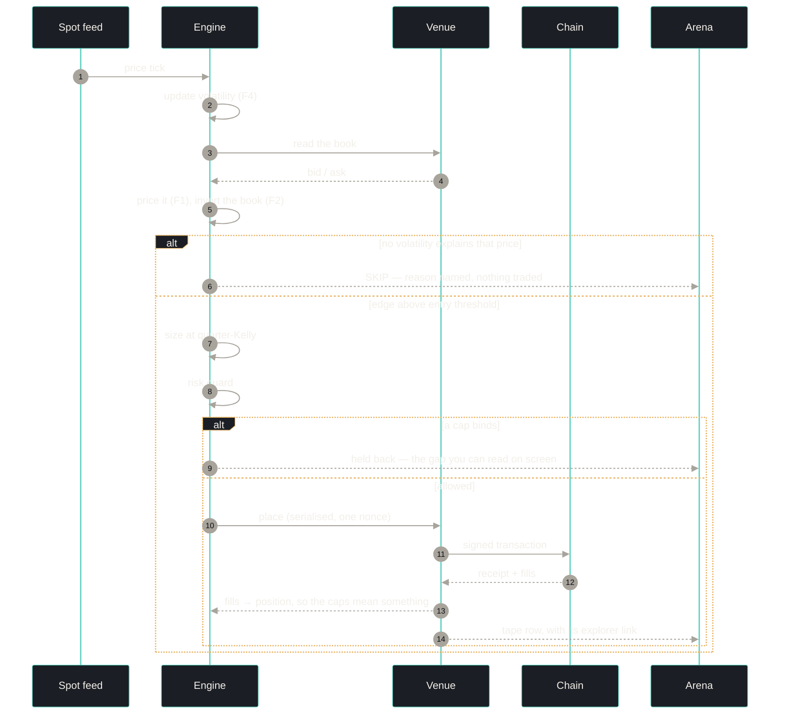
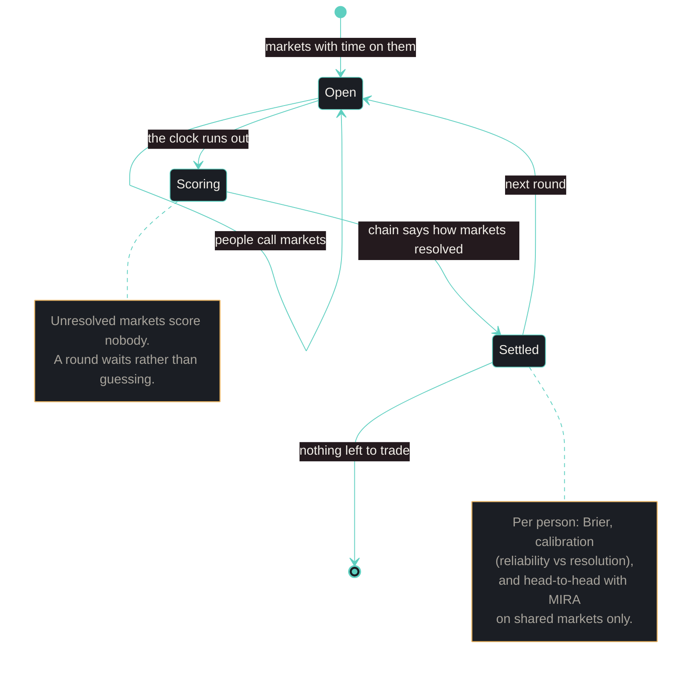

# Dream Arena

An autonomous agent trading binary prediction markets on Somnia testnet, and a
place to watch it do so.

**MIRA** forecasts volatility from live spot prices, prices each market from that
forecast, and trades only where its probability and the order book disagree by
more than fees, spread and noise. **ECHO** is a second agent that quotes both
sides so there is a counterparty — these venues launched with a trade count of
zero, so without it the tape is empty by construction.

Every order either agent signs, and every fill it takes, lands on Somnia testnet
and links to the block explorer from the trade tape.

---

## How it fits together



### One tick, end to end



### The round, and what each person gets



## Run it

Both agents need funded testnet wallets. See `docs/70-FUNDING.md`; `npm run fund`
reports what is missing and pulls tUSDC from the on-chain faucet.

```bash
npm install
npm run fund                 # check STT + tUSDC on both wallets
npm run agent                # MIRA — also serves the API and WebSocket on :8080
npm run echo                 # ECHO — the counterparty
npm run web                  # the site on :3000
```

`VENUE_MODE=LIVE` is the default (RFC-003). `Ctrl-C` on either agent cancels its
resting orders before exiting.

With Docker: `docker compose up --build`.

| route | what it is |
|---|---|
| `/` | what the system is, with live figures from the running agent |
| `/arena` | the live board, tape, MIRA's commentary, your own record |
| `/mira` | how the agent prices a market — the actual formulas |
| `/console` | operator controls, token-gated |

## Verify it yourself

Nothing here asks to be believed.

```bash
npm run smoke:live -- --dry  # read the live venue without trading
npm run smoke:live           # place a real far-from-mid order and cancel it
npm run test:live            # the G4 suite against the real chain
npm run replay               # reconstruct any recorded session from its journal
npm run gates                # G1..G6
```

Every fill on the tape carries its transaction hash and opens on the
[Shannon explorer](https://shannon-explorer.somnia.network).

## How it decides

| step | what happens |
|---|---|
| **F4** volatility | exponentially-weighted moving variance over log returns, updated every tick |
| **F1** price | `P = N(d₂)`, `d₂ = [ln(S/K) − σ²τ/2] / (σ√τ)` — the Itô term matters; without it the edge at the money is overstated by ~0.60 |
| **F2** invert | read the book back as an implied volatility; where no volatility produces the quoted price, the market is refused rather than traded |
| signal | enter above `EDGE_IN`, hold until below `EDGE_OUT` — two thresholds, so noise cannot cause churn |
| size | quarter-Kelly on the measured edge, then whichever hard cap binds first |

`edge` is measured in **volatility**, not probability: `sigmaForecast − sigmaImplied`.

## What it does not claim

- **Not proven profitable.** Over a short session, profit and loss says more about
  the market than about the model.
- **The testnet book is thin.** These venues have no organic flow; prices there are
  not what a deep market would produce.
- **Spot comes from an exchange.** Real prices, read from Binance, not from the venue.
- **A skip is not a failure.** Most markets are refused most of the time — that is
  the model declining to guess.

## Layout

```
packages/shared   frozen types, config, maths, clocks
packages/data     event bus, JSONL journal, spot ingester, store projections
packages/core     EWMV, pricer, signals, sizing, risk guard, engine, ECHO, persona
packages/venue    Venue interface, SimulatedVenue, DreamDEXVenue, tx queue, reconciler
packages/api      WebSocket broadcaster, REST, hunt settlement, MIRROR, calibration
packages/ops      agent + ECHO entrypoints, arena server, scripts
apps/web          the site
docs/             architecture, frozen interfaces, task cards, test plan, runbook
state/journal/    one JSONL per run — every decision, replayable
```

## Documents

- `docs/10-ARCHITECTURE.md` — components, dataflow, latency budget
- `docs/20-INTERFACES.md` — the frozen contracts every lane builds against
- `docs/40-TESTPLAN.md` — GWT-1..8 and the gate checklists
- `docs/50-DEMO-RUNBOOK.md` — the demo script
- `docs/70-FUNDING.md` — testnet funding, verified endpoints
- `docs/80-DEPLOY.md` — where each process can run, and why the agent cannot be serverless
- `docs/submission/sdk-feedback.md` — findings for the DEX team, reproduced live
- `docs/rfc/` — the three amendments made during the build, with reasoning
- `state/STATE.md` — build ledger and every correction made along the way

## Licence

MIT © 2026 Dedan Okware. See [LICENSE](LICENSE).

This software trades on a **test network** with valueless tokens. It is a
research and demonstration project, not financial advice and not audited for
production use with real funds.
